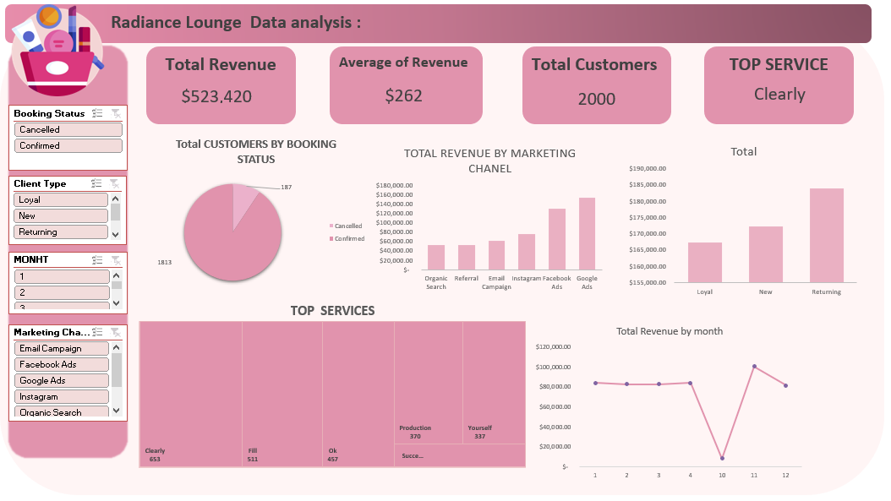

# 💄 Radiance Lounge Data Analysis Dashboard

## 📌 Project Overview

This project analyzes Radiance Lounge customer and revenue data to understand business performance, customer behavior, marketing channel effectiveness, and service demand.

The dashboard provides interactive insights about revenue, customers, booking status, client types, marketing channels, and top-performing services.

---

## 📊 Dashboard Preview

---

## 🎯 Objectives

- Analyze total revenue and customer performance
- Understand booking status distribution
- Identify the most profitable marketing channels
- Analyze customer types and behavior
- Discover top requested services
- Track revenue trends over time

---

## 🛠 Tools Used

- Microsoft Excel
- Pivot Tables
- Data Cleaning
- Data Visualization
- Dashboard Design

---

## 📈 Key Insights

- Total Revenue reached **$523,420**
- The dashboard analyzed **2,000 customers**
- Average revenue per customer is **$262**
- Confirmed bookings represent the majority of customer bookings
- Google Ads and Facebook Ads are among the strongest marketing channels
- Returning customers contribute significantly to revenue
- "Clearly" is the top-performing service based on demand
- Revenue changes across months showing different business patterns

---

## 🔍 Dashboard Features

### KPIs:
- Total Revenue
- Average Revenue
- Total Customers
- Top Service

### Visualizations:
- Customers by Booking Status
- Revenue by Marketing Channel
- Revenue by Client Type
- Top Services Analysis
- Monthly Revenue Trend
- Interactive Filters

### Filters:
- Booking Status
- Client Type
- Month
- Marketing Channel

